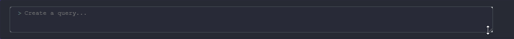
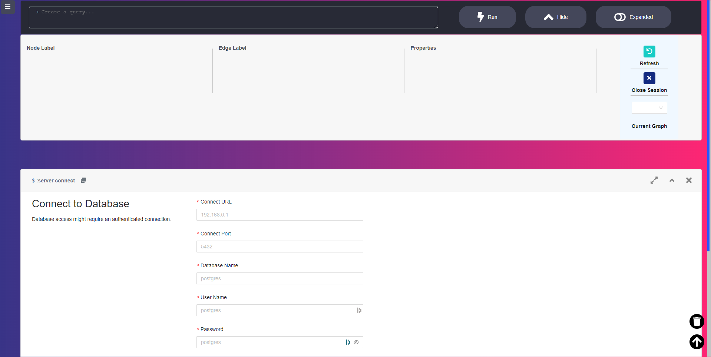
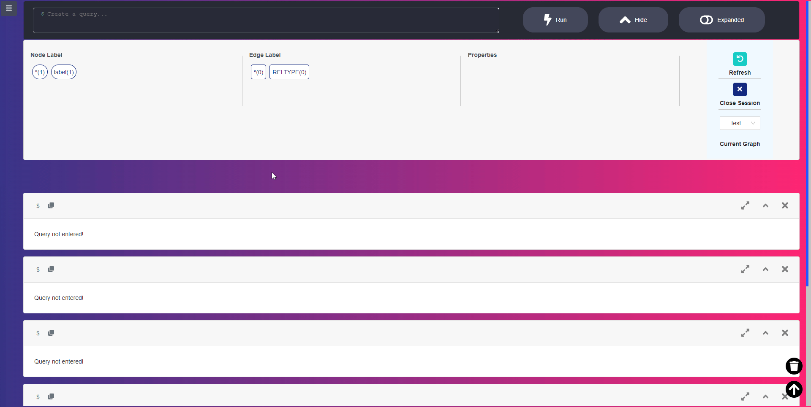
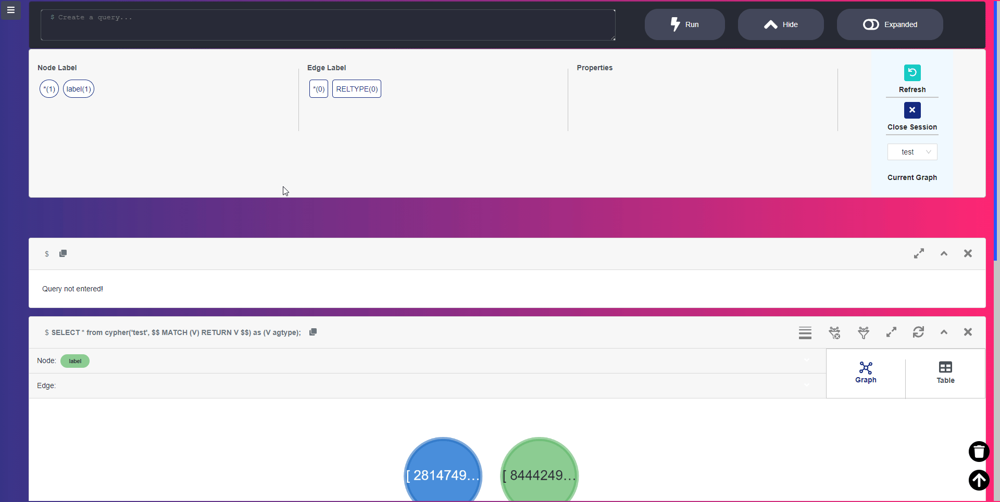

# My version of Apache Age-Viewer
It still inherits from the original Apache Age-Viewer, but I added some minor functions and improved the UI design. 
\
**NOTE: THIS WAS ONLY TESTED IN DEVELOPMENT MODE**

# Node Version
- Node version - ^14.16.0

# How to use
- Clone this repository
- install the required modules using: `npm run setup`
- Run the server: `npm run start`

# Changes I Made:
- **Query Editor**
  - I used the **dracula** theme to make background more visible. The query input is also set to **dracula** theme to apply colors to the syntax. This will make the query more readable and recognize its structure.
  
  - I have added a **border** and **name** on the buttons in the editor. This will allow the developer to know what kind of button are they pressing. I also added a changed color when hovered to make it more appealing.
  
- **Frame**
  - I added a margin on the *copy to editor* button to prevent it from sticking to close to the **command**.
  
- **MISC**
  - I only changed the color of the **Query Generator** button to make it blend with the **Query Editor**.
  
  - I have changed the body color from plain white to Apache's Age Viewer gradient icon.
  
  - I have added a **Trash** button icon. It clears the current **Frame** in the page. This is beneficial for other developers who have multiple frames in the screen and wants to clear all of them.
  
  - I have added a **Scroll To Up** button that let's the user go back at the top of the page. This is helpful for other developers who have a lot of frames active at the page.
  